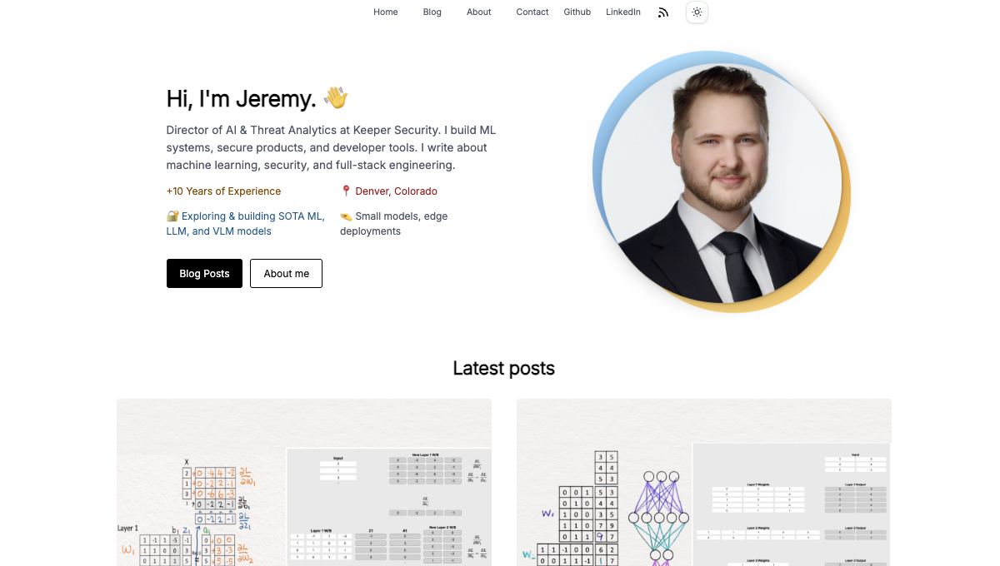

# 🧑‍💻 jeremylondon.com - My Personal Blog

Welcome to jeremylondon.com, a space where I share my journey, insights, and experiences in the world of coding and beyond. This blog is not just a repository of my thoughts but a canvas for my adventures in technology, travel, and life's myriad experiences.


## About jeremylondon.com

jeremylondon.com is my personal corner on the internet, a blog where I document my coding projects, travel diaries, and life lessons. It's a place for me to connect with like-minded individuals, share knowledge, and perhaps inspire others along the way.

## [Live Site](https://jeremylondon.com/)

<picture>
  <source media="(prefers-color-scheme: dark)" srcset="public/opengraph-dark.png">
  
</picture>

## Features

- **Personal Insights**: Dive deep into my personal experiences with coding, travel, and more, offering a unique perspective on the challenges and joys these adventures bring.
- **Tech Tutorials**: From beginner to advanced levels, find tutorials that demystify complex coding concepts and provide practical tips to enhance your programming skills.
- **Travel Diaries**: Join me as I explore new places, share travel tips, and recount the stories behind the photographs.
- **Life Lessons**: Beyond coding and travel, I share the lessons life teaches me, hoping to spark a conversation or offer a new viewpoint.

## How to Navigate

jeremylondon.com is designed for ease of navigation, allowing you to delve into the topics that interest you the most:

### Categories

Explore the world of deep learning through the following categories:

- **Deep Learning Basics**: Dive into the foundational concepts of deep learning. Explore the building blocks that power neural networks and AI innovations.
- **Deep Learning Networks**: Unravel the complexities of neural networks. From CNNs to RNNs, learn how these architectures drive the future of AI.
- **Advance Deep Learning**: Push the boundaries of AI with advanced deep learning techniques. Explore cutting-edge research and applications shaping our world.
- **Deep Learning Principals**: Master the principles that underpin deep learning. Gain insights into the theory and practice that fuel AI progress.

Choose a category to delve deeper into the fascinating world of deep learning.

## Getting Started

To run the blog locally, you'll need Node.js and pnpm installed on your system. Follow these steps to get started:

1. Clone this repository to your local machine.
2. Install the project dependencies with `pnpm install`.
3. Start the development server with `pnpm dev.`
4. Open your browser and visit <http://localhost:4321> to see the blog in action.

## Project Structure

Inside of your Astro project, you'll find the following directories and files:

```text
/
├── public/
│   └── ...
├── src/
│   ├── components/
│   │   └── ...
│   ├── layouts/
│   │   └── ...
│   └── pages/
│       └── ...
└── package.json
```

Astro looks for `.astro` or `.md` files in the `src/pages/` directory. Each page is exposed as a route based on its file name.

Any static assets, like images, can be placed in the `public/` directory. These files will be copied into the final build.

## Engage with Me

I love hearing from readers and fellow adventurers. Whether it's a question, a suggestion, or a story you'd like to share, feel free to reach out through the contact form on the site. Let's make this blog a vibrant community of shared stories and insights.

## Reporting Issues

If you come across any bugs, have suggestions for improvements, or want to request new features, please submit an issue in the GitHub repository. Your feedback is highly appreciated!

## Follow My Journey

Stay updated with my latest posts by subscribing to the newsletter. Follow me on social media for real-time updates, snippets of my daily life, and more.

## License

This project is licensed under the MIT License. See the [LICENSE](LICENSE) file for details.
